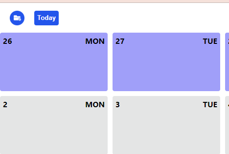
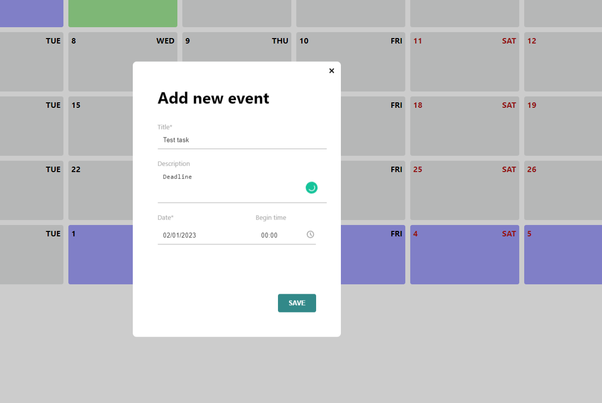
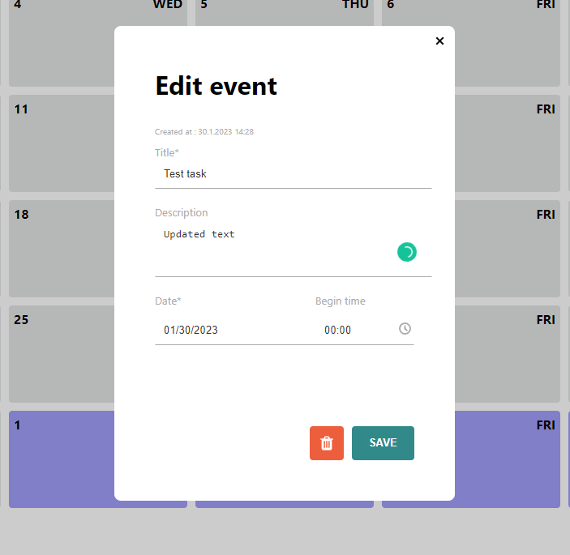
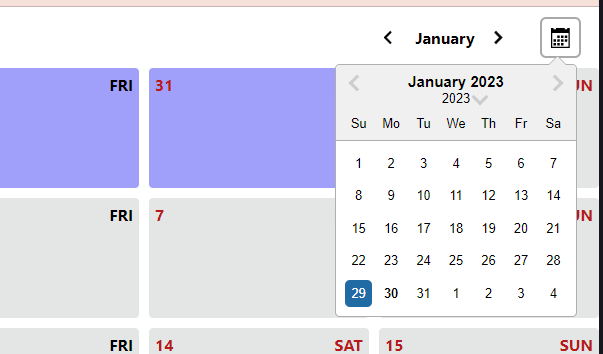
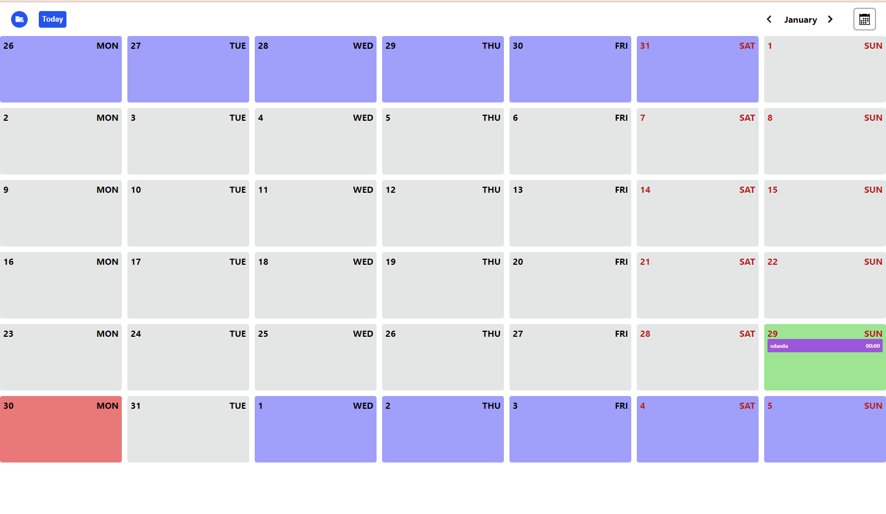
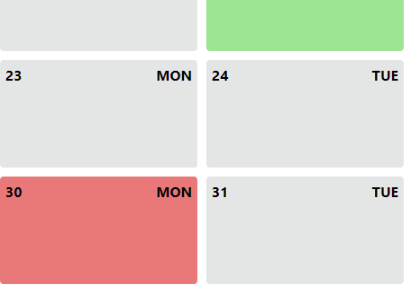

Calendar App ( local storage)
Main page of application. This page consisting of :

Form opening button (Add event button)

By the click on add event button an unfilled form will open. 
The form consists of 3 fields:
- Title (required)
- Description
- Date (required)
- Time
The "Save" button saves event and closes the form.

  Editing/deleting events
- Clicking the event opens the completed form in editing mode. It is on the form
  created at/ updated at
- "Save" button updates the event and closes the form

  
  
  
  Filter by date (I used React DatePicker). By default current day and month is selected.
  
  
  
  
  Calendar grid of the selected month in the filter. It consists of days (cells).
  
  
  
  Also current day cell is higlighted in the calendar grid by different color
  
  
